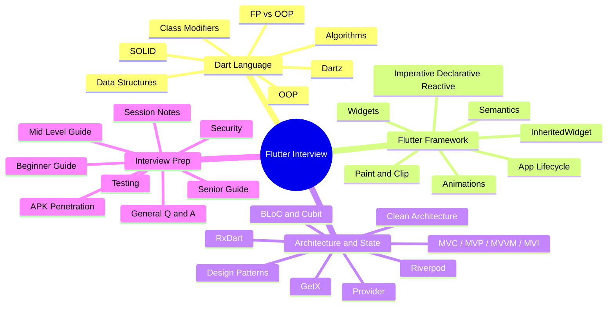

# Dart & Flutter Interview Preparation

> A personal collection of questions, answers, and resources gathered from real technical interviews — organized in one place to save preparation time.

---

## File Navigation

| File | Topics |
|------|--------|
| [`dart.md`](./dart.md) | OOP · SOLID · Class Modifiers · Algorithms · Data Structures · FP vs OOP · Dartz · Binary Tree Diameter |
| [`flutter.md`](./flutter.md) | Widgets · Animations · Lifecycle · Paint & Clip · Semantics · InheritedWidget · Imperative/Declarative/Reactive UI · MaterialStateProperty |
| [`architecture-and-state.md`](./architecture-and-state.md) | MVC/MVP/MVVM · Clean Architecture · Design Patterns · BLoC · Riverpod · GetX · Provider · RxDart |
| [`interview-prep.md`](./interview-prep.md) | Beginner → Senior Guides · General Q&A · Testing · Security · APK Penetration · Git · SQL · Session Notes |
| [`live_coding/`](./live_coding/) | Isolates · Extensions · Singletons · `super` / `this` · Runes · Streams · Lifecycle demos |
| [`code_examples/`](./code_examples/) | Architecture (MVC/MVP/MVVM/MVI) · Design Patterns · Data Structure & Algorithm solutions in Dart |
| [`pdf/`](./pdf/) | PDF exports of key topic files |

---

## Topics Overview

---

## Official Documentation

| Resource | Link |
|----------|------|
| Flutter | [docs.flutter.dev](https://docs.flutter.dev/) |
| Flutter Cookbook | [docs.flutter.dev/cookbook](https://docs.flutter.dev/cookbook) |
| Flutter Performance | [docs.flutter.dev/perf](https://docs.flutter.dev/perf) |
| Flutter Animations | [docs.flutter.dev/ui/animations](https://docs.flutter.dev/ui/animations) |
| Dart | [dart.dev/guides](https://dart.dev/guides) |
| Dart Null Safety | [dart.dev/null-safety](https://dart.dev/null-safety) |
| Dart Isolates | [dart.dev/language/isolates](https://dart.dev/language/isolates) |
| Dart Packages | [pub.dev](https://pub.dev) |

---

## State Management

| Package | Link |
|---------|------|
| BLoC / Cubit | [bloclibrary.dev](https://bloclibrary.dev/#/gettingstarted) |
| Riverpod | [riverpod.dev — Why Riverpod?](https://riverpod.dev/docs/introduction/why_riverpod) |
| GetX | [pub.dev/packages/get](https://pub.dev/packages/get#reactive-state-manager) |
| GetX — GetBuilder vs Obx | [Stack Overflow](https://stackoverflow.com/questions/67121941/flutter-get-when-to-use-getxcontroller-getbuildercontroller-or-obx?rq=3) |
| Provider | [pub.dev/packages/provider](https://pub.dev/packages/provider) |
| Provider — Flutter docs | [Simple app state management](https://docs.flutter.dev/data-and-backend/state-mgmt/simple) |

---

## Architecture & Design Patterns

| Resource | Link |
|----------|------|
| Clean Architecture (Reso Coder) | [resocoder.com/flutter-clean-architecture](https://resocoder.com/2019/08/27/flutter-tdd-clean-architecture-course-1-explanation-overview/) |
| MVP vs MVVM | [educba.com/mvp-vs-mvvm](https://www.educba.com/mvp-vs-mvvm/) |
| MVP vs MVVM (Android) | [geeksforgeeks.org](https://www.geeksforgeeks.org/difference-between-mvp-and-mvvm-architecture-pattern-in-android/) |
| Architecture Patterns in Flutter | [Medium — samra.sajjad](https://medium.com/@samra.sajjad0001/unleashing-creativity-exploring-architecture-patterns-in-flutter-12b7465bc927) |
| Dart Design Patterns (AhmedLSayed9) | [github.com/AhmedLSayed9/dart_design_patterns](https://github.com/AhmedLSayed9/dart_design_patterns) |
| Dart Design Patterns (hamed-rezaee) | [github.com/hamed-rezaee/dart_design_patterns_collection](https://github.com/hamed-rezaee/dart_design_patterns_collection) |

---

## Testing

| Resource | Link |
|----------|------|
| Flutter Testing Docs | [docs.flutter.dev/testing](https://docs.flutter.dev/testing) |
| Mockito for Dart | [pub.dev/packages/mockito](https://pub.dev/packages/mockito) |
| bloc_test | [pub.dev/packages/bloc_test](https://pub.dev/packages/bloc_test) |
| Very Good Testing (blog) | [verygood.ventures/blog/guide-to-flutter-testing](https://verygood.ventures/blog/guide-to-flutter-testing) |

---

## CI / CD & DevOps

| Resource | Link |
|----------|------|
| GitHub Actions | [docs.github.com/actions](https://docs.github.com/en/actions/using-workflows/about-workflows) |
| Fastlane for Flutter | [docs.flutter.dev/deployment/cd](https://docs.flutter.dev/deployment/cd) |
| Shorebird (code push) | [shorebird.dev](https://shorebird.dev) |

---

## SQL Reference

| Resource | Link |
|----------|------|
| W3Schools SQL | [w3schools.com/sql](https://www.w3schools.com/sql/default.asp) |
| sqflite (Flutter SQLite) | [pub.dev/packages/sqflite](https://pub.dev/packages/sqflite) |

---

## Related Repositories

| Repo | Description |
|------|-------------|
| [flutter-interview-questions](https://github.com/power19942/flutter-interview-questions) | Community Flutter interview Q&A |
| [flutter_interview_topics](https://github.com/debasmitasarkar/flutter_interview_topics) | Curated Flutter interview topics |

---

## Other Interview Resources

| Resource | Link |
|----------|------|
| InterviewBit — Flutter | [interviewbit.com/flutter-interview-questions](https://www.interviewbit.com/flutter-interview-questions/) |
| Simplilearn — Flutter | [simplilearn.com](https://www.simplilearn.com/flutter-interview-questions-article) |
| Turing — Flutter | [turing.com/interview-questions/flutter](https://www.turing.com/interview-questions/flutter) |
| Fullstack.cafe — Flutter | [fullstack.cafe/blog/flutter-interview-questions](https://www.fullstack.cafe/blog/flutter-interview-questions) |
| Fullstack.cafe — Dart | [fullstack.cafe/blog/dart-interview-questions](https://www.fullstack.cafe/blog/dart-interview-questions) |
| Fullstack.cafe — Flutter Q&A | [fullstack.cafe/interview-questions/flutter](https://www.fullstack.cafe/interview-questions/flutter) |
| Ingenious Minds — BLoC | [ingeniousmindslab.com/blogs](https://ingeniousmindslab.com/blogs/flutter-bloc-interview-question-2023/) |
| ClimbTheLadder — BLoC | [climbtheladder.com](https://climbtheladder.com/flutter-bloc-interview-questions/) |
| InterviewPrep — BLoC | [interviewprep.org](https://interviewprep.org/bloc-pattern-interview-questions/) |
